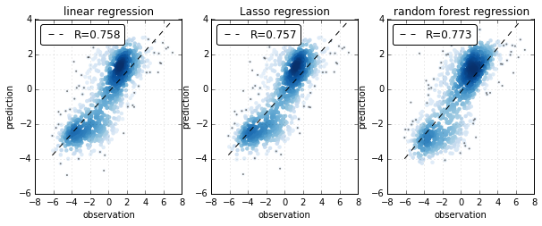
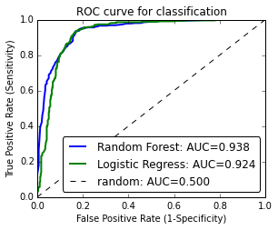

# Tutorial for cross-validation wrap

### Load data


```python
import h5py
import numpy as np
import scipy.stats as st

# regression
f = h5py.File("../data/regression_data.hdf5", "r")
X = np.array(f["X"])
Y = np.array(f["Y"])
f.close()

# classification
idx = (Y < -0.5) + (Y > 0.5)
X1 = X[idx,:]
Y1 = (Y[idx] > 0.5).astype("int")
```

### Regression


```python
# import os
# os.chdir("../")

import pylab as pl
import matplotlib
from sklearn import linear_model
from sklearn.ensemble import RandomForestRegressor
from hilearn import CrossValidation, corr_plot
%matplotlib inline

# define the model objects
linreg = linear_model.LinearRegression()
lassoreg = linear_model.LassoCV(cv=3)
randforest = RandomForestRegressor(n_estimators=100, n_jobs=-1)

fig = pl.figure()
pl.subplot(1,3,1)
# Cross-Validation wrap & corr_plot
CV = CrossValidation(X,Y)
Y_pre = CV.cv_regression(linreg)
corr_plot(Y, Y_pre, size=20)

pl.xlabel("observation")
pl.ylabel("prediction")
pl.title("linear regression")
pl.ylim(-6,4)

pl.subplot(1,3,2)
CV = CrossValidation(X,Y)
Y_pre = CV.cv_regression(lassoreg)
corr_plot(Y, Y_pre, size=20)
pl.xlabel("observation")
pl.ylabel("prediction")
pl.title("Lasso regression")
pl.ylim(-6,4)

pl.subplot(1,3,3)
CV = CrossValidation(X,Y)
Y_pre = CV.cv_regression(randforest)
corr_plot(Y, Y_pre, size=20)
pl.xlabel("observation")
pl.ylabel("prediction")
pl.title("random forest regression")
pl.ylim(-6,4)

fig.set_size_inches(10,3.5)
# fig.savefig("cv_regression.pdf", dpi=300, bbox_inches='tight')
pl.show()
```





### Classification


```python
import scipy.stats as st
from sklearn import linear_model
from sklearn.ensemble import RandomForestClassifier
from hilearn import ROC_plot, CrossValidation

LogisticRegression = linear_model.LogisticRegression()
RF_class = RandomForestClassifier(n_estimators=100, n_jobs=-1)

CV = CrossValidation(X1, Y1)
Y1_pre, Y1_score = CV.cv_classification(model=RF_class, folds=10)
Y2_pre, Y2_score = CV.cv_classification(model=LogisticRegression, folds=10)

fig = pl.figure()
ROC_plot(Y1, Y1_score[:,1], label="Random Forest", base_line=False)
ROC_plot(Y1, Y2_score[:,1], label="Logistic Regress")
pl.title("ROC curve for classification")

fig.set_size_inches(4.5,3.5)
# fig.savefig("cv_classification.pdf", dpi=300, bbox_inches='tight')
pl.show()
```





### Test on Mixture of linear regression


```python
from hilearn import MixLinearRegression

mixlinreg = MixLinearRegression()
mixlinreg.fit(X,Y,K=3,run_min=100, gap_ratio=0.0001)
print mixlinreg.bic, mixlinreg.loglik
# flexmix: 3894.991, -1805.886

mixlinreg = MixLinearRegression()
mixlinreg.fit(X,Y,K=4,run_min=100, gap_ratio=0.0001)
print mixlinreg.bic, mixlinreg.loglik
# flexmix: 3925.898, -1772.986
```

    3900.86507656 -1808.82355506
    3908.89353456 -1764.48349711


```python

```
