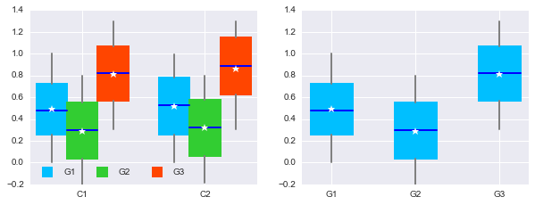
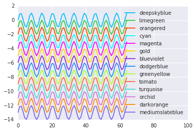

# Tutorials for hilearn plots

### boxgroup


```python
import seaborn
import pylab as pl
import numpy as np
from hilearn.plot import boxgroup
%matplotlib inline

data1 = [np.random.rand(500), np.random.rand(300)-0.2,  np.random.rand(100)+0.3]
data2 = [np.random.rand(400), np.random.rand(100)-0.2,  np.random.rand(150)+0.3]

fig = pl.figure(figsize=(10,3.5))
pl.subplot(1,2,1)
bp = boxgroup([data1, data2], labels=("G1","G2","G3"), conditions=["C1", "C2"])
pl.subplot(1,2,2)
bp = boxgroup(data1, conditions=("G1","G2","G3"))
pl.show()
```





### favorite color for use


```python
import seaborn
import numpy as np
import pylab as pl
import matplotlib
from hilearn.plot import set_colors
%matplotlib inline
    
favorite_colors = set_colors()

fig = pl.figure()
xx = np.arange(65)
for i in range(14):
    pl.plot(xx, np.sin(xx)-i, label="%s" %favorite_colors[i])
pl.legend()
pl.xlim(0,100)
pl.show()
```





### venn3_plot


```python
import seaborn
import numpy as np
import pylab as pl
import matplotlib
from hilearn.plot import venn3_plot
%matplotlib inline

fig = pl.figure()
set1 = set(['A', 'B', 'C', 'D'])
set2 = set(['B', 'C', 'D', 'E'])
set3 = set(['C', 'D',' E', 'F', 'G'])
v = venn3_plot([set1, set2, set3], ('Set1', 'Set2', 'Set3'))
pl.show()
```


```python

```
